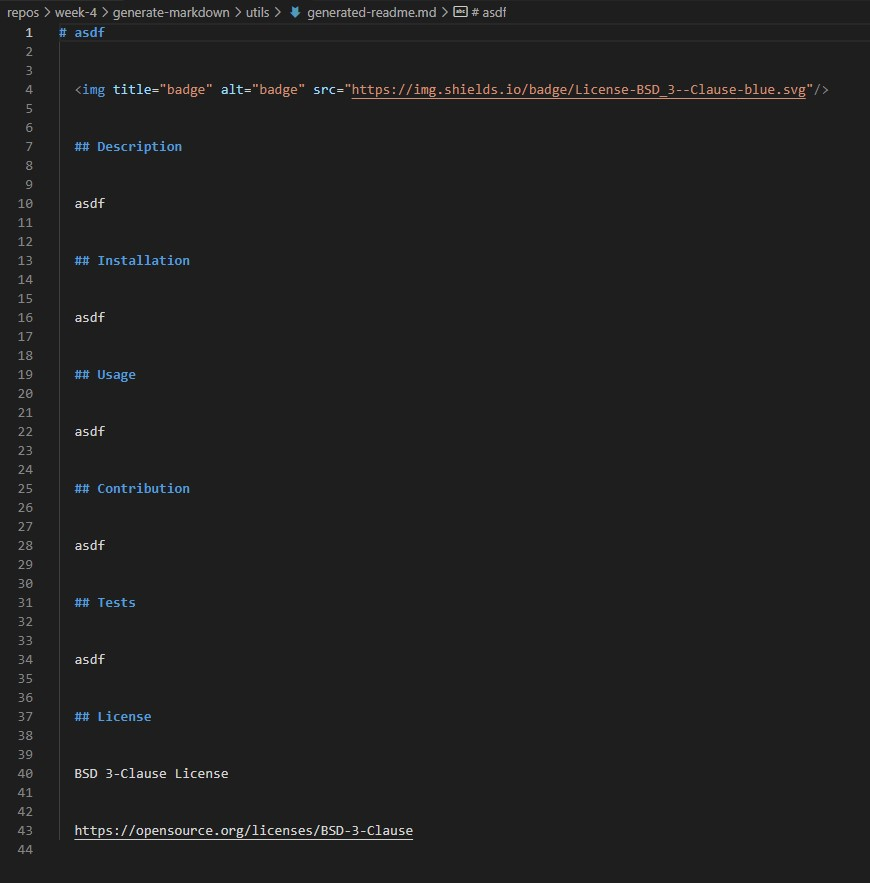

# Common text title

Repository Name: generate-markdown

## Description 

This project constructs a readme.md file by writing user input from the terminal to a newly created document.  Any subsequent use will overwrite the current document. 

* User input code:
```md
        inquirer
            .prompt([
                {
                    type: 'input',
                    message: 'What is the title of your project?',
                    name: 'title'
                },
                {
                    type: 'input',
                    message: 'Please describe your project.',
                    name: 'description'
                },
                {
                    type: 'input',
                    message: 'Please add your installation instructions.',
                    name: 'installation'
                },
                {
                    type: 'input',
                    message: 'Please describe how to use your application.',
                    name: 'usage'
                },
                {
                    type: 'input',
                    message: 'Please explain how others are meant to contribute to your project.',
                    name: 'contribution'
                },
                {
                    type: 'input',
                    message: 'Please explain how to test your application.',
                    name: 'tests'
                },
                {
                    type: 'list',
                    message: 'Please choose from the provided list of licenses',
                    name: 'license',
                    choices: listOfLicenses
                }
            ])
```

## Technologies

Technologies used on this project include:
* Javascript
* Node.JS
* NPM Inquirer & FS (& custom module exports)


## Table of Contents (Optional)

* [Installation](#installation)
* [Usage](#usage)
* [Final Product](#finalproduct)

## Installation

1. Must have Node.js installed and running.
2. Please npm install inquirer and fs.

## Usage 

To begin using this site after insstall requirements:

1. Simply type 'node index.js' into the terminal.
2. Answer the questions that you are prompted with.
3. Check to see that your file was generated in the same directory.

## Final Product




Github Repository
https://github.com/Blec333/generate-markdown


## Video

[](https://drive.google.com/open?id=1zYRgi7fHBNVysP9sRmMibwGhw_arHON6&authuser=bleclair3%40gmail.com&usp=drive_fs "Video")

https://drive.google.com/open?id=1zYRgi7fHBNVysP9sRmMibwGhw_arHON6&authuser=bleclair3%40gmail.com&usp=drive_fs

### License

MIT License

Copyright (c) 2022 Brennan LeClair

Permission is hereby granted, free of charge, to any person obtaining a copy
of this software and associated documentation files (the "Software"), to deal
in the Software without restriction, including without limitation the rights
to use, copy, modify, merge, publish, distribute, sublicense, and/or sell
copies of the Software, and to permit persons to whom the Software is
furnished to do so, subject to the following conditions:

The above copyright notice and this permission notice shall be included in all
copies or substantial portions of the Software.

THE SOFTWARE IS PROVIDED "AS IS", WITHOUT WARRANTY OF ANY KIND, EXPRESS OR
IMPLIED, INCLUDING BUT NOT LIMITED TO THE WARRANTIES OF MERCHANTABILITY,
FITNESS FOR A PARTICULAR PURPOSE AND NONINFRINGEMENT. IN NO EVENT SHALL THE
AUTHORS OR COPYRIGHT HOLDERS BE LIABLE FOR ANY CLAIM, DAMAGES OR OTHER
LIABILITY, WHETHER IN AN ACTION OF CONTRACT, TORT OR OTHERWISE, ARISING FROM,
OUT OF OR IN CONNECTION WITH THE SOFTWARE OR THE USE OR OTHER DEALINGS IN THE
SOFTWARE.


### Acknowledgements

©Brennan LeClair
